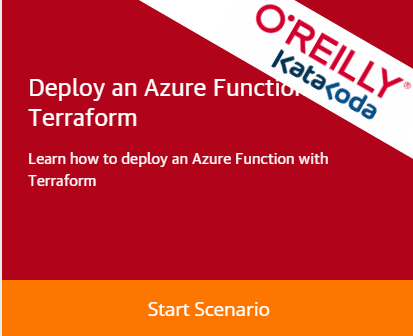

# Terraform: de eerste stappen

Deze repository dient ter ondersteuning van het artikel in het VX Magazine.

## De "sandbox" omgeving

Je kunt de stappen uiteraard zelf op je werkstation uitvoeren, maar je kunt ook een omgeving gebruiken waar alles voor je wordt klaargezet! Wij gebruiken hier Katacoda voor, een platform van de uitgever O'Reilly.

Binnen Katacoda is er een VX Company Terraform cursus met daarin het scenario uit het artikel. Klik op de link, start het scenario en volg de aanwijzingen op het scherm.

https://www.katacoda.com/vxcompany/courses/real-world-terraform

